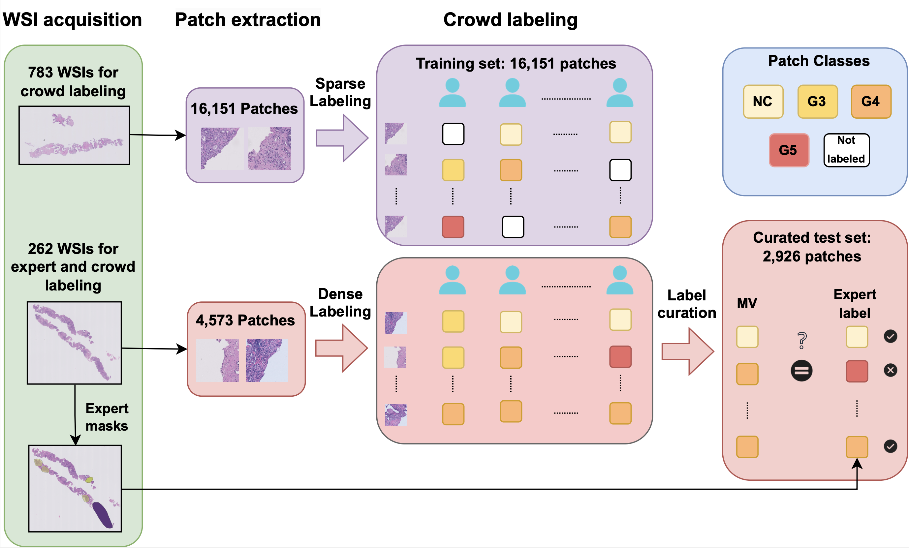

# CrowdGleason



This repo contains associated information with the publication *"The CrowdGleason dataset: Learning the Gleason grade from crowds and experts"*. We include the related citation, the dataset access at Zenodo, and the code to reproduce the experiments.


## Citation 

```
@article{lopez2024crowdgleason,
  title={The CrowdGleason dataset: Learning the Gleason grade from crowds and experts},
  author={L{\'o}pez-P{\'e}rez, Miguel and Morquecho, Alba and Schmidt, Arne and P{\'e}rez-Bueno, Fernando and Mart{\'\i}n-Castro, Aurelio and Mateos, Javier and Molina, Rafael},
  journal={Computer Methods and Programs in Biomedicine},
  volume={257},
  pages={108472},
  year={2024},
  publisher={Elsevier}
}
```

## Data

Dataset publicly available at: https://zenodo.org/records/14178894

## Code

The code is included in the folder `code/`, we use GPflow 1 for the crowdsourcing methods and PyTorch 1 for feature extraction.

For feature extraction use `pip install torch`.

For classification and ablation study use `requeriments.txt`.


### Feature Extraction

- `code/configs/`  
  Contains the config files for the experiments.

- `code/feature_extraction/`  
  Contains the code to train a CNN prostate classifier on SICAP and extract features from CrowdGleason.
  1. `train_feat_extractor.py` – Trains the classifier on SICAP.
  2. `predict_features.py` – Extracts features from SICAP and CrowdGleason using the trained model.

### Classification

- `code/classification/`  
  Contains scripts to run classification models and experiments.
  1. `main.py` – Runs the crowdsourcing methods on a single dataset.
  2. `run_gp_both.py` – Runs the Gaussian Process (GP) methods on the combined dataset.
  3. `run_svgpmix.py` – Runs the model combining expert and crowd annotations on the combined dataset.

### Ablation Study

- `code/ablation_study/`  
  Contains scripts to evaluate model robustness under different conditions.
  1. `main.py` – Runs ablation studies varying the number of annotators.
  2. `run_svgpmix.py` – Runs ablation studies varying the number of expert-labeled samples.
  3. `senior_vs_junior.py` – Compares crowdsourcing methods based on annotator expertise (senior vs. junior).


